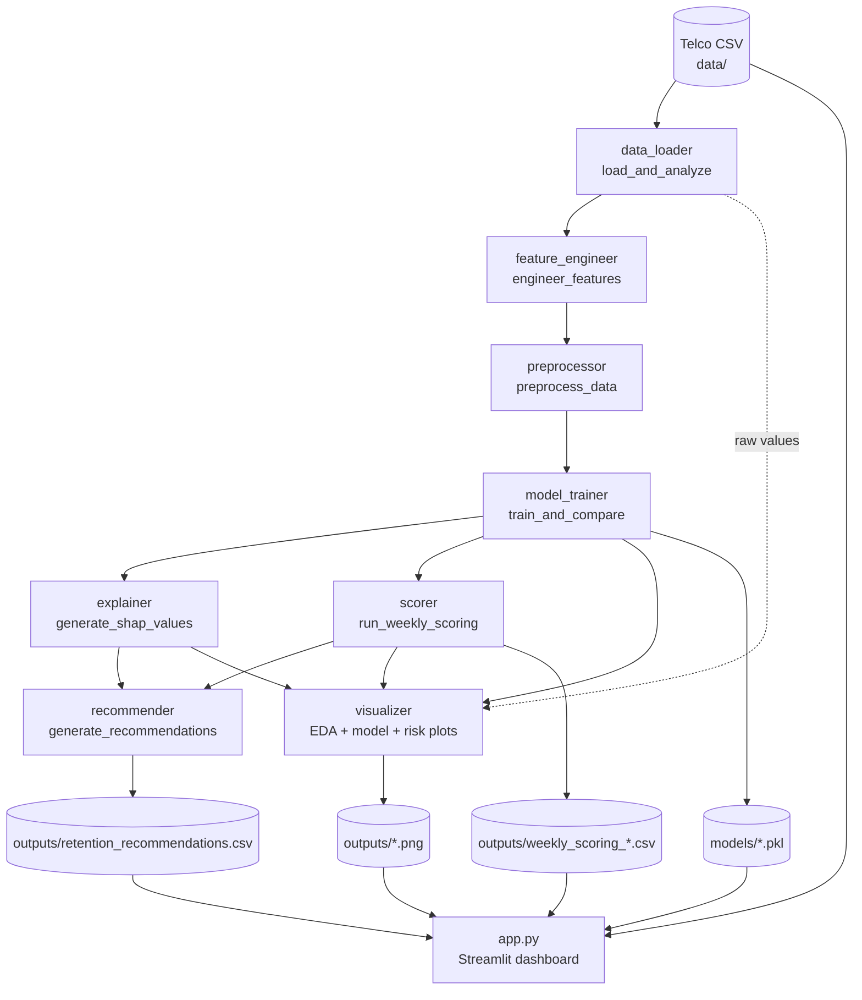
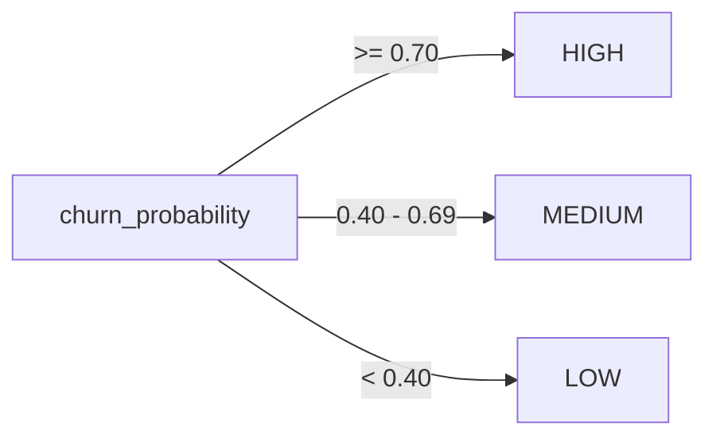

# Design Document

## Overview

The Customer Churn Prediction System is an end-to-end machine learning application that ranks telecom customers by their likelihood to cancel service, explains the drivers behind each prediction, segments customers into actionable risk tiers, and recommends concrete retention actions. It is built on the IBM Telco Customer Churn dataset (7,043 customers, 20 raw features).

The system has two clearly separated halves:

1. **Offline pipeline** (`main.py` + `src/` modules) — a sequential batch job that loads and validates data, engineers business features, preprocesses, trains and compares three models, explains the best model with SHAP, scores all customers, generates retention recommendations, renders visualizations, and persists artifacts to `models/` and `outputs/`.
2. **Interactive dashboard** (`app.py`) — a read-only Streamlit application that consumes the pre-saved artifacts and presents six navigable views. It never retrains a model; it only reads CSVs, PNGs, and pickled models.

This design documents the **as-is implemented system** (Requirements 1–11) as realized in the existing source code, and describes how the **roadmap requirements** (Requirements 12–16) would integrate without disturbing the current architecture.

### Design Goals

- **Determinism and reproducibility**: fixed seeds (`random_state=42`), a deterministic train/test split, and stable feature ordering so a rerun reproduces the same artifacts.
- **Separation of concerns**: each `src/` module owns a single pipeline stage with a narrow function-level interface, so stages can be tested and replaced independently.
- **Graceful degradation in the UI**: the dashboard treats every artifact as optional and shows an informative message rather than crashing when one is missing.
- **Robustness to known data quirks**: the blank `TotalCharges` problem and SHAP version/shape variability are handled defensively at every stage that touches them.

### Key Research Findings Informing the Design

- **Blank `TotalCharges`**: The IBM Telco dataset stores some `TotalCharges` cells as a single space (`" "`) rather than `NaN`. pandas therefore reads the column as `object` (text) and `isnull()` does not flag those cells. Both `data_loader` (detection/reporting) and `feature_engineer`/`preprocessor` (coercion to `float64` and median fill) account for this. These blank rows correspond to brand-new customers with `tenure = 0`.
- **Class imbalance**: only ~26.5% of customers churn, so every model is configured for imbalance (balanced class weights for Logistic Regression and LightGBM; `scale_pos_weight = negatives/positives` for XGBoost), and AUC-ROC is used as the primary selection metric rather than accuracy.
- **SHAP output shape variability**: SHAP returns values in different shapes across versions and model families (2D array, list of per-class arrays, 3D array, or an `Explanation` object). The system normalizes all of these to a 2D positive-class array via a shared `_to_positive_class_array` helper (duplicated in `explainer.py` and `recommender.py` so each module stands alone).
- **`Contract`/`PaymentMethod` double-encoding avoidance**: feature engineering converts these to ordinal `contract_risk` and `payment_risk` scores, so preprocessing intentionally excludes them from one-hot encoding and drops the original string columns to avoid duplicated signal.

## Architecture

### High-Level Structure



### Orchestration Flow

`main.py` runs the 11 stages in strict order, each wrapped in a `try/except` that prints a labeled section header, and on failure prints which step failed and exits with a non-zero status (`sys.exit(1)`). All filesystem paths are anchored to the script directory (`BASE_DIR = os.path.dirname(os.path.abspath(__file__))`) so the pipeline behaves identically regardless of the current working directory.

A subtle but important detail captured in the architecture: **EDA visualizations run on a freshly reloaded raw copy** of the CSV (with original `Yes`/`No`, `Month-to-month` strings), not on the encoded `df_processed`, because the EDA charts need human-readable categorical values.

The human-readable model name returned by training (`"XGBoost"`, `"LightGBM"`, `"Logistic Regression"`) is mapped to the short SHAP `model_type` tag (`"xgboost"`, `"lightgbm"`, `"logistic"`) via `MODEL_TYPE_MAP` before explainability runs.

### Dashboard Architecture

`app.py` is a single-file Streamlit app using:

- **Cached loaders** (`@st.cache_data` for data frames, `@st.cache_resource` for models) so navigation between views stays responsive and heavy SHAP/metric recomputation happens at most once per session.
- A **top horizontal navigation bar** built from `st.columns` + `st.button`, with the active page tracked in `st.session_state.active_page`. The active button uses Streamlit's `primary` type so scoped CSS can highlight it.
- A **dark-theme CSS block** injected via `st.markdown(..., unsafe_allow_html=True)` plus `.streamlit/config.toml` for theme consistency.
- **Best-effort live recomputation**: because `model_trainer` saves models but the pipeline only persists `results_dict.pkl` (not a metrics table the app reads), the app rebuilds the test split and recomputes metrics/SHAP on demand, falling back to saved PNGs when recomputation is not possible.

### Technology Stack

| Concern | Choice |
|---|---|
| Language | Python 3 |
| Data | pandas, numpy |
| Modeling | scikit-learn (LogisticRegression, StandardScaler, metrics), xgboost, lightgbm |
| Explainability | shap |
| Static plots | matplotlib, seaborn |
| Dashboard + interactive plots | streamlit, plotly |
| Serialization | joblib |

## Components and Interfaces

Each module exposes a small number of functions with stable signatures. The pipeline passes plain pandas/numpy objects between stages (no shared global state).

### `data_loader.py`

```
load_and_analyze(filepath: str) -> pandas.DataFrame
```
Loads the CSV and prints an exploratory report: shape, dtypes, head, missing values per column, duplicate count, blank/whitespace `TotalCharges` count, churn distribution and rate, numerical vs categorical column lists, and basic stats for `tenure`/`MonthlyCharges`/`TotalCharges`. Returns the raw (uncleaned) DataFrame. (Requirement 1)

### `feature_engineer.py`

```
engineer_features(df: pandas.DataFrame) -> pandas.DataFrame
```
Operates on raw string categoricals. Coerces `TotalCharges` to `float64`, then adds seven engineered features: `tenure_group` (0–3 ordinal), `charges_per_month_ratio` (`TotalCharges/(tenure+1)`), `has_multiple_services` (0–6 count), `is_high_value` (`MonthlyCharges>70`), `contract_risk` (3/2/1), `payment_risk` (2/1/0), `no_support_services` (1 if both `TechSupport` and `OnlineSecurity` are "No"). Prints a per-feature summary and returns the augmented DataFrame. (Requirement 2)

### `preprocessor.py`

```
preprocess_data(df) -> (X_train, X_test, y_train, y_test, scaler, feature_names, df_processed)
```
Cleans blank `TotalCharges` → median fill, drops `customerID`, encodes `Churn` to 1/0, label-encodes binary columns, one-hot encodes multi-class columns with `drop_first=True` (excluding `Contract`/`PaymentMethod`, which are dropped), casts boolean dummies to int, performs a stratified 80/20 split (`random_state=42`), and fits a `StandardScaler` on `[tenure, MonthlyCharges, TotalCharges]` using the training set only before transforming both splits. (Requirement 3)

### `model_trainer.py`

```
train_and_compare(X_train, X_test, y_train, y_test, feature_names) -> (best_model, all_results, best_model_name)
```
Scrubs residual NaN to 0 (preserving column names), trains three imbalance-aware models, evaluates AUC-ROC/Precision/Recall/F1/Accuracy on the test set, prints a comparison table and per-model confusion matrices, selects the best model by test AUC-ROC, and saves all three models plus `best_model.pkl`. `all_results[name]` holds `{"model", "metrics", "y_pred", "y_proba"}`. (Requirement 4)

### `explainer.py`

```
generate_shap_values(model, X_train, X_test, feature_names, model_type) -> (shap_values_2d, explainer)
plot_shap_summary(shap_values, X_test, feature_names) -> str  # saved path
explain_single_customer(shap_values, X_test, feature_names, customer_index=0) -> dict
generate_explanation_text(explanation_dict, feature_names) -> str
```
Selects `TreeExplainer` for tree models and `LinearExplainer` for logistic regression, falling back to the generic `shap.Explainer` on failure. Normalizes SHAP output to a 2D positive-class array. `explain_single_customer` returns the top 3 features by absolute SHAP value with direction labels; `generate_explanation_text` renders them as plain language using a business-friendly name map. (Requirement 5)

### `scorer.py`

```
run_weekly_scoring(model, scaler, X_test, feature_names, week_number=1) -> pandas.DataFrame
```
Fills NaN with 0, computes positive-class probability per customer, assigns risk tiers (`>=0.70` HIGH, `>=0.40` MEDIUM, else LOW), builds a scoring table (`customer_index`, `churn_probability` rounded to 4 dp, `risk_level`, `scoring_week`, `scoring_date`), prints per-tier counts/percentages, and saves `outputs/weekly_scoring_week_{n}.csv`. (Requirement 6)

### `recommender.py`

```
generate_recommendations(scoring_df, X_test_df, shap_values, feature_names) -> pandas.DataFrame
```
Filters to HIGH-risk customers, selects each customer's top 3 risk-increasing SHAP features (falling back to absolute magnitude if none are positive), maps the top driver to a retention action via priority-ordered substring rules, and writes `outputs/retention_recommendations.csv`. When there are no HIGH-risk customers, it writes a header-only CSV and returns an empty DataFrame. (Requirement 7)

### `visualizer.py`

```
plot_churn_distribution(df) -> str
plot_correlation_heatmap(df) -> str
plot_churn_by_contract(df) -> str
plot_churn_by_tenure(df) -> str
plot_monthly_charges_vs_churn(df) -> str
plot_model_comparison(results_dict) -> str
plot_confusion_matrix(y_test, y_pred, model_name) -> str
plot_risk_segmentation(scoring_df) -> str
plot_churn_probability_distribution(scoring_df) -> str
```
Every function saves a PNG to `outputs/` and returns the path. `plot_confusion_matrix` slugifies the model name (lowercase, spaces and `/` → `_`) for a filesystem-safe filename. (Requirement 8)

### `main.py`

```
run_pipeline() -> None
```
Orchestrates all stages with labeled headers, per-step error handling, directory creation, and final artifact persistence (`best_model.pkl`, `scaler.pkl`, `results_dict.pkl`, `feature_names.pkl`). (Requirement 9)

### `app.py`

A Streamlit module with cached loaders (`load_scoring_df`, `load_recommendations_df`, `load_raw_data`, `load_models`, `compute_model_metrics`, `compute_shap_top_features`), Plotly chart builders, and six page functions (Overview, Model Performance, Risk Segmentation, Feature Importance & SHAP, Retention Recommendations, Customer Drill-Down) dispatched by a top nav bar. (Requirements 10, 11)

## Data Models

### Raw Input Record (Telco CSV)

20 features plus `customerID` and the `Churn` target. Key columns:

| Column | Type | Notes |
|---|---|---|
| `customerID` | str | Dropped during preprocessing |
| `gender`, `Partner`, `Dependents`, `PhoneService`, `PaperlessBilling` | str (binary) | Label-encoded to 0/1 |
| `SeniorCitizen` | int (0/1) | Already numeric |
| `tenure` | int | Months as customer |
| `MonthlyCharges` | float | |
| `TotalCharges` | str → float | Blank/space cells coerced to NaN then median-filled |
| `Contract`, `PaymentMethod` | str | Converted to ordinal risk scores, originals dropped |
| `MultipleLines`, `InternetService`, `OnlineSecurity`, `OnlineBackup`, `DeviceProtection`, `TechSupport`, `StreamingTV`, `StreamingMovies` | str (multi-class) | One-hot encoded with `drop_first=True` |
| `Churn` | str (Yes/No) | Target, encoded to 1/0 |

### Engineered Features

| Feature | Type | Definition |
|---|---|---|
| `tenure_group` | int 0–3 | New ≤12, Early 13–24, Mid 25–48, Loyal 49+ |
| `charges_per_month_ratio` | float | `TotalCharges / (tenure + 1)` |
| `has_multiple_services` | int 0–6 | Count of add-on services == "Yes" |
| `is_high_value` | int 0/1 | `MonthlyCharges > 70` |
| `contract_risk` | int 1–3 | Month-to-month=3, One year=2, Two year=1 |
| `payment_risk` | int 0–2 | Electronic check=2, Mailed check=1, auto-pay=0 |
| `no_support_services` | int 0/1 | `TechSupport == "No"` AND `OnlineSecurity == "No"` |

### Scoring Record (`weekly_scoring_week_{n}.csv`)

| Field | Type | Notes |
|---|---|---|
| `customer_index` | int | Row position in scored matrix |
| `churn_probability` | float | Positive-class probability, rounded to 4 dp |
| `risk_level` | str | HIGH / MEDIUM / LOW |
| `scoring_week` | int | Week number |
| `scoring_date` | str | ISO date of the run |

### Recommendation Record (`retention_recommendations.csv`)

| Field | Type | Notes |
|---|---|---|
| `customer_index` | int | |
| `risk_level` | str | Always HIGH in populated rows |
| `churn_probability` | float | |
| `top_reason_1/2/3` | str | Top SHAP-driven feature names |
| `recommended_action` | str | Rule-mapped action string |

### Persisted Model Artifacts (`models/`)

`logistic_regression.pkl`, `xgboost_model.pkl`, `lightgbm_model.pkl`, `best_model.pkl`, `scaler.pkl`, `results_dict.pkl`, `feature_names.pkl` — all joblib-serialized.

### Risk Tier Domain



## Correctness Properties

*A property is a characteristic or behavior that should hold true across all valid executions of a system — essentially, a formal statement about what the system should do. Properties serve as the bridge between human-readable specifications and machine-verifiable correctness guarantees.*

These properties cover the pure, input-varying logic of the **implemented** system (Requirements 1–11). Reporting/printing, plot side effects, filesystem persistence, orchestration ordering, UI styling, and configuration checks are validated by example, integration, or smoke tests instead (see Testing Strategy). Roadmap Requirements 12–16 are not implemented and have no properties yet.

The property set below reflects redundancy elimination: structural preprocessing invariants are consolidated, split-determinism folds reproducibility (11.2) into the split property, and weak metric-range checks remain as example tests rather than properties.

### Property 1: Blank/whitespace TotalCharges detection

*For any* DataFrame whose `TotalCharges` column contains a known number of blank or whitespace-only cells, the reported count of blank `TotalCharges` values equals the number of blank/whitespace cells actually present.

**Validates: Requirements 1.5**

### Property 2: Churn rate computation

*For any* target column of `Yes`/`No` values, the reported churn rate equals `churned / (churned + stayed) * 100`, where `churned` and `stayed` are the respective value counts.

**Validates: Requirements 1.6**

### Property 3: TotalCharges coerced to float64

*For any* raw DataFrame (including rows with blank or whitespace `TotalCharges`), after feature engineering the `TotalCharges` column has dtype `float64`.

**Validates: Requirements 2.2**

### Property 4: tenure_group ordinal banding

*For any* tenure value, `tenure_group` equals 0 when tenure ≤ 12, 1 when 13 ≤ tenure ≤ 24, 2 when 25 ≤ tenure ≤ 48, and 3 when tenure ≥ 49.

**Validates: Requirements 2.3**

### Property 5: charges_per_month_ratio identity

*For any* row, `charges_per_month_ratio` equals `TotalCharges / (tenure + 1)`, and the computation never divides by zero (including tenure = 0).

**Validates: Requirements 2.4**

### Property 6: has_multiple_services count

*For any* row, `has_multiple_services` equals the count of the six add-on service columns whose value is "Yes", and the result lies in [0, 6].

**Validates: Requirements 2.5**

### Property 7: is_high_value threshold

*For any* row, `is_high_value` equals 1 if and only if `MonthlyCharges > 70`, otherwise 0.

**Validates: Requirements 2.6**

### Property 8: contract_risk mapping

*For any* row, `contract_risk` equals 3 for "Month-to-month", 2 for "One year", and 1 for "Two year".

**Validates: Requirements 2.7**

### Property 9: payment_risk mapping

*For any* row, `payment_risk` equals 2 for "Electronic check", 1 for "Mailed check", and 0 for "Bank transfer (automatic)" or "Credit card (automatic)".

**Validates: Requirements 2.8**

### Property 10: no_support_services indicator

*For any* row, `no_support_services` equals 1 if and only if both `TechSupport` and `OnlineSecurity` are "No", otherwise 0.

**Validates: Requirements 2.9**

### Property 11: All engineered features present

*For any* valid raw DataFrame, the output of feature engineering contains all seven engineered columns (`tenure_group`, `charges_per_month_ratio`, `has_multiple_services`, `is_high_value`, `contract_risk`, `payment_risk`, `no_support_services`) in addition to the original columns.

**Validates: Requirements 2.10**

### Property 12: TotalCharges cleaning leaves no missing values

*For any* DataFrame with blank/whitespace or missing `TotalCharges`, after preprocessing the `TotalCharges` column is numeric and contains no NaN, with previously-missing entries filled by the column median.

**Validates: Requirements 3.1**

### Property 13: Preprocessing produces a clean numeric matrix

*For any* valid raw DataFrame, the processed feature matrix contains no `customerID` column, no original `Contract` or `PaymentMethod` string columns, and every feature column is numeric.

**Validates: Requirements 3.2, 3.5, 3.6**

### Property 14: Churn target encoding

*For any* `Churn` column of `Yes`/`No` values, the encoded target maps "Yes" to 1 and "No" to 0, and its value domain is a subset of {0, 1}.

**Validates: Requirements 3.3**

### Property 15: Binary column label encoding

*For any* of the binary categorical columns (gender, Partner, Dependents, PhoneService, PaperlessBilling), the encoded values lie within {0, 1}.

**Validates: Requirements 3.4**

### Property 16: Stratified, reproducible train/test split

*For any* valid dataset, the train/test split places ≈20% of rows in the test set, the train and test partitions are disjoint and together cover all rows, the churn class ratio is preserved (within a small tolerance) across both sets, and re-running with the fixed seed produces identical splits.

**Validates: Requirements 3.7, 11.2**

### Property 17: Scaler fitted on training data only

*For any* valid dataset, the scaled training numerical columns (`tenure`, `MonthlyCharges`, `TotalCharges`) have approximately zero mean and unit standard deviation, and the fitted scaler's parameters equal those computed from the training split alone (no test-set leakage).

**Validates: Requirements 3.8**

### Property 18: NaN scrub preserves feature columns

*For any* feature matrix containing NaN values, after the training-time scrub the matrix contains no NaN and its column names and order are unchanged.

**Validates: Requirements 4.3**

### Property 19: Best model is the AUC-ROC argmax

*For any* results dictionary of models with metric sub-dicts, the selected best model is the one with the maximal test-set AUC-ROC.

**Validates: Requirements 4.6**

### Property 20: SHAP normalization to 2D positive-class array

*For any* SHAP output in a supported shape (2D array, list of per-class arrays, 3D `(samples, features, classes)` array, or an `Explanation` object), the normalized result is a 2D array of shape `(n_samples, n_features)` for the positive (churn) class.

**Validates: Requirements 5.3**

### Property 21: Single-customer top-3 explanation

*For any* SHAP value row, `explain_single_customer` returns exactly the three features with the largest absolute SHAP values, and each returned direction is "increases risk" when its SHAP value is positive and "decreases risk" otherwise.

**Validates: Requirements 5.5**

### Property 22: Explanation text references each top reason

*For any* explanation dictionary, the generated human-readable text contains one line per top reason, referencing each selected feature.

**Validates: Requirements 5.6**

### Property 23: Churn probabilities are valid

*For any* feature matrix, scoring produces exactly one churn probability per row and every probability lies in [0, 1].

**Validates: Requirements 6.1**

### Property 24: Risk tiering thresholds

*For any* churn probability, the assigned tier is HIGH if and only if probability ≥ 0.70, MEDIUM if and only if 0.40 ≤ probability < 0.70, and LOW otherwise.

**Validates: Requirements 6.3**

### Property 25: Scoring table schema and rounding

*For any* feature matrix, the scoring table contains the columns `customer_index`, `churn_probability`, `risk_level`, `scoring_week`, and `scoring_date`, and every `churn_probability` is rounded to 4 decimal places.

**Validates: Requirements 6.4**

### Property 26: Recommendations cover exactly the HIGH-risk customers

*For any* scoring DataFrame, the recommendations output contains exactly one row per HIGH-risk customer (and none for MEDIUM/LOW), and every output row includes the columns `customer_index`, `risk_level`, `churn_probability`, `top_reason_1`, `top_reason_2`, `top_reason_3`, and `recommended_action`.

**Validates: Requirements 7.1, 7.4**

### Property 27: Top-3 risk-increasing drivers

*For any* HIGH-risk customer's SHAP row, the three selected reasons are the features with the largest positive SHAP values; when no feature has a positive SHAP value, they are the features with the largest absolute SHAP values.

**Validates: Requirements 7.2**

### Property 28: Rule-based action mapping

*For any* top-driver feature name, the recommended action equals the action of the first matching rule in priority order (contract → annual-contract offer; tenure → customer-success manager; charges → discount/loyalty; missing support/security → free tech-support upgrade; fiber/internet → investigate service quality; otherwise → schedule retention call).

**Validates: Requirements 7.3**

### Property 29: Filesystem-safe confusion-matrix filename

*For any* model name string, the generated confusion-matrix filename contains no spaces and no `/` characters and is lowercase.

**Validates: Requirements 8.5**

## Error Handling

- **Missing dataset file (1.2)**: `pd.read_csv` raises `FileNotFoundError`; in the pipeline this surfaces through `main.py`'s per-step `try/except`, which prints `[ERROR] STEP 1 (Load & Analyze Data) failed: ...`, prints the traceback, and exits with status 1.
- **Blank/whitespace `TotalCharges`**: detected and reported in `data_loader`; coerced to `NaN` then median-filled in `preprocessor`; coerced to `float64` in `feature_engineer` to make arithmetic safe even under the pyarrow string backend.
- **Residual NaN before model fit/predict (4.3, 6.2)**: `model_trainer` and `scorer` replace NaN with 0 before fitting/predicting, re-wrapping arrays in DataFrames to preserve column names that downstream SHAP and visualization rely on.
- **SHAP explainer failure (5.2)**: the primary explainer (Tree/Linear) is wrapped in `try/except`; on failure the system falls back to the generic `shap.Explainer` rather than crashing.
- **SHAP shape variability (5.3)**: `_to_positive_class_array` normalizes every supported SHAP output form to a 2D positive-class array.
- **No HIGH-risk customers (7.5)**: the recommender writes a header-only CSV and returns an empty DataFrame with the correct columns, without raising.
- **Pipeline stage failure (9.3)**: each `main.py` stage is individually guarded; the first failure stops the pipeline with a clear, step-identified message and non-zero exit code.
- **Missing dashboard artifact (10.2)**: every cached loader returns `None` when its file is absent, and each page renders an `st.error`/`st.warning` (or falls back to a saved PNG) instead of crashing. Model loaders swallow load exceptions per file.
- **Working-directory independence (9.4)**: all paths are anchored to `BASE_DIR`/`PROJECT_ROOT` so missing-file errors cannot be caused merely by launching from a different directory.

## Testing Strategy

### Dual Approach

- **Property-based tests** verify the universal properties above across many generated inputs. They target the pure, input-varying logic: feature engineering, preprocessing invariants, risk tiering, SHAP normalization and selection, recommendation mapping, and slugification.
- **Example and edge-case unit tests** verify concrete behaviors and boundary/error conditions: missing-file handling, the explainer fallback path, the no-HIGH-risk recommendation case, NaN-laden scoring inputs, and the metric computations (which mostly delegate to scikit-learn).
- **Integration and smoke tests** verify orchestration ordering, working-directory independence, artifact persistence, dependency/config presence, and that the dashboard reads (never retrains).

### Property-Based Testing Library and Configuration

- Use **Hypothesis** (the standard property-based testing library for Python). Do not implement property-based testing from scratch.
- Run each property test for a minimum of **100 iterations** (`@settings(max_examples=100)` or higher).
- Tag each property test with a comment in the format: **Feature: customer-churn-prediction, Property {number}: {property_text}**.
- Implement each correctness property with a **single** property-based test.
- Build generators (Hypothesis strategies) that produce realistic Telco-shaped frames: random `tenure`, `MonthlyCharges`, `TotalCharges` (including blank/space strings), valid `Contract`/`PaymentMethod`/service categories, and `Yes`/`No` targets — including boundary values (tenure 12/13/24/25/48/49, MonthlyCharges 70, probabilities 0.40/0.70) so edge cases (Requirements 6.2, 7.5, special characters in model names) are exercised by the generators.
- For SHAP-dependent properties (20, 21, 27), generate synthetic SHAP-shaped arrays directly rather than training real models, keeping iterations fast and deterministic.

### Example / Edge-Case / Integration / Smoke Coverage

| Requirement(s) | Test type | Focus |
|---|---|---|
| 1.1, 1.3, 1.4 | Example | Load + report against the real dataset |
| 1.2 | Edge case | Nonexistent path → clear error, pipeline stops |
| 4.1, 4.2, 4.4, 4.5 | Example | Three models trained, imbalance config, metric keys in [0,1] |
| 4.7, 6.6, 7.6, 9.5, 11.1, 11.3, 11.4 | Smoke | Artifacts/files/config/docs exist |
| 5.1, 5.4 | Example | Correct explainer per model type; summary PNG saved |
| 5.2 | Edge case | Forced primary-explainer failure → fallback, no crash |
| 6.5 | Example | Per-tier summary printed |
| 8.1–8.4 | Example | Each plot writes its PNG to `outputs/` |
| 9.1, 9.4 | Integration | End-to-end ordered run; identical artifacts across working directories |
| 9.2, 9.3 | Example / edge case | Section headers printed; forced stage failure → `SystemExit(1)` |
| 10.1, 10.3, 10.4, 10.5, 10.6 | Example | Read-only loaders, six views, overview metrics, filter/sort helpers, drill-down details |
| 10.2 | Edge case | Each artifact removed → loader returns `None`, page degrades gracefully |
| 10.7, 10.8 | Smoke / manual | Cache decorators present; readable styling and non-clipped nav (visual review) |

### Notes on Roadmap (Requirements 12–16)

These are not implemented. When built, recommended testing: the scoring API (12) via endpoint integration tests plus payload-validation edge cases; PostgreSQL storage (13) via integration tests and migration smoke tests; automated retraining (14) via integration tests plus a property on the promotion AUC-ROC threshold; CLV integration (15) via a property on the combined churn-probability × CLV priority ordering; and A/B testing (16) via a property on balanced control/treatment assignment plus example tests for result reporting.
